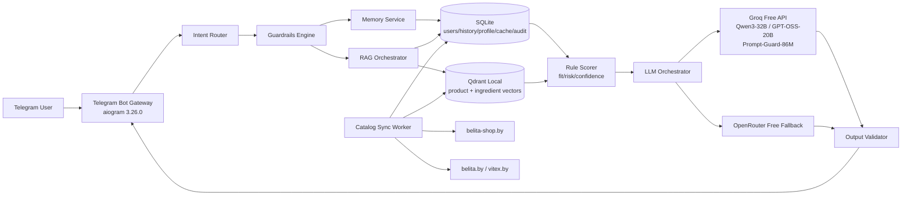

# ARCHITECTURE — BELITA Skin Match

Сегодня: `2026-03-28`  
Роль: `P-20 Technical Architect`  
Объект: `Telegram Bot MVP`  
Режим: `No code, architecture only`

## 0. Проверка входных данных

### Подтвержденный стек

| Слой | Выбор | Почему |
|---|---|---|
| Bot framework | `Python 3.12 + aiogram 3.26.0` | Пользователь зафиксировал Python/aiogram; docs.aiogram.dev на `2026-03-28` показывают `aiogram 3.26.0` |
| Реляционная БД | `SQLite` | 100% free, open-source, без карты, без SaaS-квот, достаточно для пользователей, памяти и истории на MVP |
| Векторная БД | `Qdrant local mode` | 100% free, open-source, dense/sparse/hybrid retrieval, локальная on-disk persistence, без карты |
| Embeddings | `local FastEmbed-compatible multilingual model` | Не тратит API-квоты, не требует платного embedding-provider |
| Основной LLM | `Groq Free API` | Есть бесплатные модели и официальные rate limits |
| Fallback LLM | `OpenRouter free models` | Бесплатный резервный канал на случай исчерпания квот у Groq |
| Packaging | `modular monolith` | Быстро для MVP, но без архитектурного тупика |
| Deployment | `single host / single container set` | Для zero-budget MVP не нужна сервисная декомпозиция |

### Подтвержденный формат
- `Telegram Bot`
- Внутри него два режима:
  - structured questionnaire
  - free chat with domain guardrails

### Подтвержденный архитектурный стиль
- `Modular Monolith`
- `Clean Architecture` с отдельными слоями и явными портами
- `RAG + Rules + LLM`, а не `LLM-only`

### Возможные технические несостыковки

| Несостыковка | Риск | Архитектурное решение |
|---|---|---|
| `Budget = $0`, но бот должен поддерживать свободный чат | Быстрое выгорание free-tier квот | Ввести model routing, local embeddings, retrieval-first, response cache и rules-only degradation |
| Стратегия запрещает медицинскую роль, но пользователь может писать `у меня псориаз` | Юридический и репутационный риск | Хранить это как `self-reported condition`, не как диагноз; всегда включать medical-disclaimer policy |
| `Dual-mode chat` повышает стоимость каждого запроса | Рост latency и quota burn | Делить поток на `router -> rules -> retrieval -> only then LLM` |
| Zero-budget не гарантирует always-on cloud hosting | Риск недоступности бота 24/7 | Архитектуру делать portable: self-hosted Windows/Linux single-node; runtime state вне репозитория |

Критических противоречий, требующих остановки, нет. Но есть `операционный риск`: без отдельного решения по compute/hosting нельзя обещать постоянный production uptime при бюджете `$0`.

## 1. Детализация архитектуры

## 1.1 Слои системы

### Presentation Layer

**Ответственность**
- Получение Telegram updates
- Управление диалогом, callback-кнопками и пагинацией
- Передача запросов в application-use-cases
- Возврат безопасного, форматированного ответа

**Что входит**
- aiogram routers
- handlers
- middlewares
- FSM/session coordinator
- response formatter

**Что НЕ входит**
- SQL-запросы
- вызовы Qdrant напрямую
- формирование prompt бизнес-логикой
- scoring и ingredient analysis

### Application Layer

**Ответственность**
- Оркестрация use-case сценариев
- Сбор контекста для free chat и questionnaire
- Вызов guardrails, memory, retrieval, scoring, LLM adapters
- Управление транзакциями и application policies

**Что входит**
- use cases
- DTO / command / query models
- orchestrators
- policy services
- cache coordination

**Что НЕ входит**
- Telegram-specific code
- сырые SQL или vector-upsert
- доменные правила INCI в виде инфраструктурных деталей

### Domain Layer

**Ответственность**
- Ядро предметной логики
- Product fit scoring
- Ingredient taxonomy
- Recommendation rules
- Memory fact semantics
- Safety rules на бизнес-уровне

**Что входит**
- entities
- value objects
- domain services
- rule packs
- domain interfaces

**Что НЕ входит**
- aiogram
- Qdrant client
- SQLite driver
- конкретный LLM SDK

### Infrastructure Layer

**Ответственность**
- Реализация внешних адаптеров
- Хранение данных
- Retrieval
- LLM provider adapters
- Logging/telemetry
- Background sync

**Что входит**
- SQLite repositories
- Qdrant repositories
- embedding adapter
- Groq adapter
- OpenRouter adapter
- ingestion clients for Belita/Vitex
- file/log/runtime path manager

**Что НЕ входит**
- предметные решения о том, какой крем лучше
- UI-логика Telegram

## 1.2 Границы модулей

| Модуль | Назначение | Публичный интерфейс | Зависимости | Что запрещено |
|---|---|---|---|---|
| `bot.dialog` | Telegram UX и FSM | `start_flow()`, `handle_chat()`, `paginate_results()` | application layer | Прямой доступ к БД/Qdrant |
| `application.profile` | Опросник и профиль | `save_profile_answers()`, `build_profile_card()` | domain + repositories | Лезть в Telegram formatting |
| `application.chat` | Оркестрация свободного чата | `answer_free_chat()` | memory, guardrails, retrieval, llm | Генерировать ответ без safety-check |
| `domain.recommendation` | Fit/risk/confidence scoring | `score_candidates()` | domain entities | Знать про SQL/Qdrant |
| `domain.ingredients` | Таксономия INCI | `classify_ingredient()`, `derive_flags()` | ingredient dictionary | Делать сетевые вызовы |
| `domain.safety` | Медицинские и policy-правила | `classify_medical_risk()`, `validate_claims()` | domain rules | Давать итоговый Telegram reply |
| `application.rag` | Retrieval pipeline | `retrieve_candidates()` | vector + metadata repos | Вызывать Telegram |
| `application.memory` | Краткосрочная и долговременная память | `load_context()`, `commit_facts()`, `summarize_thread()` | repos + llm adapter | Хранить все подряд без фильтрации |
| `infra.catalog_ingest` | Парсинг и нормализация доноров | `sync_catalog()`, `sync_composition()` | HTTP clients, parsers, repos | Менять user data |
| `infra.observability` | Логи, audit, metrics | `log_event()`, `record_incident()` | file system + SQLite | Прятать safety incidents |

## 1.3 Потоки данных

### Основной пользовательский сценарий
`/start -> questionnaire or free chat -> safety routing -> retrieval -> scoring -> LLM explanation -> post-validation -> response -> memory update`

### Поток для questionnaire mode
1. User answers structured questions.
2. Presentation layer sends normalized answers to `application.profile`.
3. Profile service updates structured user profile in SQLite.
4. Recommendation use case applies metadata filters and RAG retrieval.
5. Domain scorer builds ranked shortlist.
6. LLM produces explanation only over approved candidates.
7. Post-validator checks forbidden medical claims.
8. Response saved to history and shown in Telegram.

### Поток для free chat mode
1. User writes free text: `у меня экзема, нужен крем без отдушек`.
2. Input passes through:
   - prompt injection detector
   - medical risk classifier
   - intent router
   - constraint extractor
3. Memory service loads:
   - durable user profile
   - prior self-reported conditions
   - thread summary
   - last messages window
4. Retrieval pipeline:
   - metadata prefilter in SQLite
   - hybrid search in Qdrant
   - domain scorer and risk penalty
5. LLM gets only:
   - approved product candidates
   - ingredient evidence
   - mandatory safety policy
6. Output validator blocks diagnosis/treatment language.
7. Safe answer returned.
8. Durable memory stores only allowed facts.

### Где происходят проверки
- Input validation: presentation + application boundary
- Domain scope / medical risk: `domain.safety`
- Candidate approval: `domain.recommendation`
- Output validation: `domain.safety` after generation

### Где происходит логирование
- request lifecycle
- retrieval path chosen
- quota/fallback events
- safety incidents
- ingestion job results
- sync drift and parsing failures

## 1.4 Architecture Spec Card

- `Architecture Pattern`: modular monolith
- `Communication Pattern`: Telegram updates + internal service calls + external HTTP to LLM APIs
- `Data Pattern`: mixed (`CRUD` for users/history + `hybrid retrieval` for product knowledge)
- `Deployment Pattern`: single host / local services / optional Docker compose
- `Service decomposition not needed: modular monolith is sufficient because MVP has one client surface, one core domain, low write concurrency and zero-budget constraints.`

### Core modules / services

| Module | Назначение | Входы/выходы | Хранилище | Внешние интеграции | Нельзя ломать |
|---|---|---|---|---|---|
| Bot Gateway | Telegram transport | updates -> commands/replies | none | Telegram Bot API | UX flows and callback contracts |
| Profile & Memory | user profile + durable facts | answers/messages -> profile context | SQLite | none | consistency of user facts |
| Catalog & Ingredient Knowledge | products + INCI knowledge | donor data -> normalized catalog | SQLite + Qdrant | Belita/Vitex sites | product/barcode/source lineage |
| Retrieval & Ranking | hybrid candidate search | query/profile -> ranked candidates | Qdrant + SQLite | none | metadata filtering before LLM |
| Guardrails Engine | scope/safety enforcement | input/output -> safe decision | SQLite audit | Groq safeguard model optional | no diagnosis/treatment claims |
| LLM Orchestrator | model routing and generation | approved context -> final answer | cached results in SQLite | Groq, OpenRouter | fallback logic and quota protection |
| Sync Worker | ingestion and reindex | schedules -> catalog updates | SQLite + Qdrant | Belita/Vitex sites | idempotent sync and source timestamps |

### Primary data stores

| Store | Что живет | Почему |
|---|---|---|
| SQLite | users, sessions, messages, summaries, structured profile, product metadata, ingredient dictionary, audit, cache indexes | транзакционность, zero-cost, simple ops |
| Qdrant local | semantic product knowledge, ingredient notes, explanation chunks, sparse+dense indexes | быстрый hybrid retrieval |

### Failure hotspots
- LLM free-tier exhaustion
- Parsing drift on donor sites
- Incorrect durable memory extraction from free chat
- Medical-risk false negatives
- Qdrant index drift after catalog update

## Mermaid-схема



## 2. Нефункциональные требования

## 2.1 Производительность

### Ожидаемая нагрузка
- MVP: low-to-medium
- ориентир: десятки одновременных диалогов, сотни пользователей в день, а не массовый public launch

### Ограничения по памяти
- SQLite и Qdrant работают локально
- embeddings и retrieval должны быть CPU-friendly
- длинный контекст нельзя тащить в prompt целиком

### Узкие места
- LLM token quotas
- retrieval latency при слишком больших chunk payloads
- summary generation при длинных ветках чата

### Производительные меры
- short context window + durable summary
- metadata prefilter before vector search
- response cache by `query_fingerprint + profile_fingerprint`
- async sync jobs вне request path

## 2.2 Надежность

- Все внешние LLM вызовы: timeout + retry with backoff + provider fallback
- Donor sync: idempotent upsert by `product_id/barcode/source_hash`
- При падении LLM: деградация в `rules-only answer` с кратким безопасным ответом
- При падении Qdrant: fallback на SQL metadata search + ограниченный catalog answer
- При падении donor sync: текущий каталог остается read-only

### Таймауты
- Telegram handler budget: короткий ACK
- LLM generation: жесткий timeout
- retrieval: низкий timeout
- donor sync: отдельный worker timeout, не влияет на bot runtime

## 2.3 Безопасность

### Работа с секретами
- Telegram token, Groq key, OpenRouter key только в env / secret file вне репозитория
- Runtime path only:
  - Windows: `%LOCALAPPDATA%\\BelitaSkinMatch\\`

### Валидация входных данных
- длина сообщений
- allowed callbacks
- sanitized free text
- URL/source allowlist for ingestion

### Векторы атак
- prompt injection
- jailbreak / role confusion
- data poisoning через donor drift
- quota exhaustion abuse
- oversized message / spam flood

### Защита
- lexical filters + safeguard model
- rate limiting per user
- response claim validator
- strict source allowlist
- no direct execution tools in chat path

## 2.4 Логирование и наблюдаемость

### Логировать обязательно
- start/finish of each request
- selected route: questionnaire / free_chat / compare / catalog
- safety flags
- chosen retrieval mode
- provider used: Groq / OpenRouter / rules-only
- sync job status
- parse mismatch
- cache hits/misses

### Уровни логирования
- `INFO`: lifecycle, sync summary
- `WARN`: fallback, quota near limit, parse drift
- `ERROR`: failed request, failed sync, validator block
- `AUDIT`: recommendation issued, medical risk flagged, data export/delete

### Где хранить
- structured logs files in `%LOCALAPPDATA%\\BelitaSkinMatch\\logs\\`
- critical audit events also duplicated in SQLite

## 2.5 API / Контракты

### Публичные интерфейсы
- Telegram Bot API as transport
- internal application contracts as source of truth

### Contract artifacts
- `docs/contracts/bot-events.md`
- `docs/contracts/recommendation-schema.md`
- `docs/contracts/catalog-entity.md`

### Error model
- normalized internal error object:
  - `code`
  - `message`
  - `retryable`
  - `safe_user_message`
  - `provider`

### Пагинация / фильтры / лимиты
- catalog browsing via cursor pagination
- filters: skin type, concern, price band, category, line, fragrance-free, sensitive-safe
- message length cap before LLM

### Rate limiting
- per-user message rate
- per-provider budget guard
- daily free-tier quota monitor

## 2.6 Distributed / Concurrency

Система не распределенная в смысле microservices, но конкурентность есть.

### Idempotency
- sync jobs keyed by `source + entity_id + source_hash`
- Telegram callback actions keyed by `message_id + callback_id`
- recommendation save keyed by `thread_id + response_hash`

### Retry / backoff
- only for external HTTP calls
- bounded retries
- no infinite retries

### Consistency model
- strong consistency нужна для user profile and memory facts in SQLite
- eventual consistency допустима для catalog sync and vector reindex

### План деградации
- no Qdrant -> SQL only
- no Groq -> OpenRouter free
- no both -> rules-only concise safe answer

## 3. RAG-архитектура

## 3.1 Что хранить в Qdrant

Хранить не просто `сырые карточки`, а нормализованные knowledge documents:

1. `product_summary_chunk`
2. `inci_explanation_chunk`
3. `usage_and_target_chunk`
4. `ingredient_risk_chunk`
5. `line_context_chunk`

### Payload каждого vector point

| Поле | Назначение |
|---|---|
| `doc_id` | уникальный id chunk |
| `product_id` | связь с SQLite |
| `barcode` | связь между донорами |
| `chunk_type` | summary / inci / usage / risk |
| `brand` | Belita / Vitex |
| `line` | серия |
| `category` | cream / cleanser / toner / serum |
| `routine_slot` | cleanse / treat / moisturize / protect |
| `skin_types` | normalized array |
| `concerns` | normalized array |
| `flags` | fragrance / acid / retinoid / essential_oil / alcohol etc. |
| `is_fragrance_free` | fast metadata filter |
| `source_url` | lineage |
| `source_hash` | reindex control |
| `text` | retrievable text |

### Retrieval mode
- Dense + Sparse + Hybrid
- Dense = semantic similarity
- Sparse = BM25 keyword recall
- Hybrid = default for free chat

## 3.2 Как бот ищет крем по запросу

Пример: `у меня экзема, нужен крем без отдушек`

### Шаг 1. Input normalization
- `self_reported_condition = eczema`
- `medical_risk = elevated`
- `hard_constraint = fragrance_free`
- `category_hint = face_cream`
- `goal = gentle_barrier_support`

### Шаг 2. Safety policy injection
В prompt попадает policy:
- не диагностировать
- не лечить
- подбирать только мягкий уход
- подчеркивать self-reported nature

### Шаг 3. Metadata prefilter in SQLite
Отсекаются продукты:
- с высоким irritant risk
- с неподходящим routine_slot
- с флагом fragrance/high essential oils

### Шаг 4. Hybrid retrieval in Qdrant
Запрос идет по нормализованной формулировке:
`мягкий крем для чувствительной кожи, без отдушек, barrier support, avoid irritants`

### Шаг 5. Domain re-scoring
Система повышает score:
- humectants
- barrier-support ingredients
- soothing ingredients

Система понижает score:
- fragrance
- high-acid actives
- aggressive retinoids
- questionable claims without ingredient support

### Шаг 6. LLM explanation over approved shortlist
LLM не ищет сам весь каталог.
LLM получает уже:
- shortlist
- ingredient evidence
- risk flags
- mandatory disclaimer

## 3.3 Ingestion flow и reindex

### Поток `belita-shop.by`
1. Sync worker читает sitemap / category pages / product pages.
2. Каждая карточка нормализуется в canonical `product`.
3. Из карточки извлекаются:
   - `product_id`
   - `barcode`
   - metadata
   - description
   - usage
   - category hints
4. Upsert в SQLite по `product_id`.
5. Если `source_hash` не изменился, reindex не запускается.

### Поток `belita.by / vitex.by`
1. Для каждого продукта с `barcode` worker запрашивает composition/source page.
2. Полный INCI парсится и раскладывается в `ingredients` + `product_ingredients`.
3. Derived flags пересчитываются.
4. Qdrant chunks перестраиваются только для изменившихся products.

### Reindex policy
- upsert-only
- idempotent by `source + entity_id + source_hash`
- hard delete запрещен без отдельного audit event
- failed parse does not wipe previous valid product snapshot

## 4. Система памяти

## 4.1 Краткосрочная память
- последние `N` сообщений треда
- последняя рекомендация
- последняя уточняющая цель

## 4.2 Долговременная память

Хранить только stable facts:
- skin_type
- sensitivity_level
- hard_avoidances
- preferred budget band
- preferred routine depth
- self-reported condition
- last accepted recommendations

### Что не хранить как durable memory
- случайные эмоции
- непроверенные медицинские выводы
- длинные свободные монологи целиком

## 4.3 Механизм памяти для свободного чата

1. Message passes fact extractor.
2. Extractor выделяет только candidate facts разрешенных классов.
3. Fact validator проверяет:
   - stable ли это
   - безопасно ли хранить
   - нужен ли disclaimer flag
4. Fact goes into SQLite with confidence and provenance.
5. Thread summary periodically compresses long conversation.

### Как хранить `псориаз`
Не как диагноз, а как:
- `fact_type = self_reported_condition`
- `value = psoriasis`
- `verified = false`
- `requires_medical_disclaimer = true`
- `usage_policy = soften_cosmetic_recommendations_only`

## 5. Guardrails

## 5.1 Pre-LLM guardrails
- keyword/regex detector for high-risk medical terms
- prompt injection detector
- domain router
- refusal/escalation policy for red flags

## 5.2 Policy injection layer

Если detected medical context:

`Я косметолог, а не врач. Я не лечу псориаз, экзему и другие заболевания. Я могу подобрать максимально мягкий косметический уход Belita/Vitex, который с низкой вероятностью навредит при self-reported состоянии, но при выраженных симптомах нужна очная консультация специалиста.`

## 5.3 Post-LLM guardrails
- claim validator blocks verbs like `лечит`, `вылечит`, `диагноз`, `назначаю`
- source validator checks that recommendation references known product ids
- response sanitizer removes unsafe certainty

## 6. Структура хранения данных

## 6.1 SQLite tables

| Таблица | Что лежит |
|---|---|
| `users` | user id, locale, consent, created_at |
| `user_profiles` | structured skincare profile |
| `user_constraints` | fragrance-free, acid-free, budget etc. |
| `conversation_threads` | active threads |
| `messages` | chat history metadata |
| `conversation_summaries` | compressed context |
| `memory_facts` | durable facts from chat |
| `recommendations` | recommendation sessions |
| `recommendation_items` | product shortlist and scores |
| `products` | canonical product metadata |
| `product_sources` | donor lineage and hashes |
| `ingredients` | ingredient dictionary |
| `product_ingredients` | product-to-ingredient mapping |
| `safety_incidents` | risky prompts and validator blocks |
| `sync_jobs` | ingestion runs |
| `response_cache` | cached answer envelope |
| `audit_events` | export/delete/critical events |

## 6.2 Qdrant collections

| Collection | Содержимое |
|---|---|
| `product_knowledge` | product summary + INCI explanation chunks |
| `ingredient_knowledge` | ingredient descriptions, functions, risk notes |

## 6.3 Ingredient taxonomy v1

### Function classes
- humectant
- emollient
- occlusive
- soothing
- barrier_support
- antioxidant
- exfoliant
- brightening
- surfactant
- preservative
- fragrance

### Risk flags
- fragrance
- essential_oil
- drying_alcohol
- strong_acid
- retinoid_like
- potential_allergen
- comedogenic_risk

### Fit tags
- dry_skin_fit
- oily_skin_fit
- sensitive_skin_fit
- acne_prone_fit
- barrier_repair_fit
- anti_pigment_fit

## 6.4 Admin QA flow

Нужен light backoffice workflow даже без полноценной админки:

1. Sync job формирует список changed products.
2. Parser marks `confidence = high | medium | low`.
3. `low confidence` продукты идут в manual review queue.
4. Только approved snapshot попадает в `active_for_recommendation = true`.
5. Safety incidents по конкретным продуктам могут временно выключать продукт из выдачи.

## 6.5 Prompt contract for bounded AI chat

LLM всегда получает 5 секций:

1. `System role`
2. `Safety policy`
3. `Allowed scope`
4. `Retrieved evidence`
5. `Output schema`

### Что запрещено в contract
- самостоятельный поиск по всему каталогу без retrieval payload
- советы по лекарствам
- постановка диагноза
- рекомендации вне Belita/Vitex в MVP

## 7. Структура проекта

```text
/ARCHITECTURE.md
/AGENTS.md
/SAAS_EXECUTION_PLAN.md
/docs/
  PROJECT_MAP.md
  EXEC_PLAN.md
  STATE.md
  state.json
  PROJECT_HISTORY.md
  DECISIONS.md
  RESEARCH_LOG.md
  /contracts/
    bot-events.md
    recommendation-schema.md
    catalog-entity.md
/src/
  /presentation/
    /telegram/
      handlers/
      routers/
      middlewares/
      keyboards/
  /application/
    /use_cases/
    /services/
    /dto/
  /domain/
    /entities/
    /value_objects/
    /services/
    /rules/
  /infrastructure/
    /db/
    /vector/
    /llm/
    /ingest/
    /observability/
    /cache/
  /shared/
    /config/
    /utils/
/tests/
  /unit/
  /integration/
  /contract/
/scripts/
  /sync/
  /maintenance/
```

### Что не должно попадать в проект
- runtime SQLite/Qdrant files
- logs
- temp files
- caches with mutable state

Runtime paths:
- `%LOCALAPPDATA%\\BelitaSkinMatch\\sqlite\\`
- `%LOCALAPPDATA%\\BelitaSkinMatch\\qdrant\\`
- `%LOCALAPPDATA%\\BelitaSkinMatch\\logs\\`
- `%TEMP%\\BelitaSkinMatch\\`

## 8. План реализации

| Stage | Цель | Критерий завершения |
|---|---|---|
| 1. Skeleton | Зафиксировать каталоги, слои, конфиг и порты | Архитектурный каркас и contracts описаны |
| 2. Catalog Core | Поднять canonical product model, SQLite schema, Qdrant schema | Product/barcode/INCI flow описан end-to-end |
| 3. Retrieval Core | Реализовать metadata filter + hybrid retrieval + scoring spec | Один user query раскладывается в понятный retrieval pipeline |
| 4. Memory Core | Реализовать thread summary, durable facts, profile merge policy | Бот помнит безопасные факты и не дублирует вопросы |
| 5. Guardrails Core | Ввести input/output safety и policy injection | Медицинские запросы переводятся в safe cosmetic mode |
| 6. Bot UX Integration | Связать questionnaire, free chat, pagination, compare | Telegram flow полностью маршрутизирован |
| 7. Ingestion & Reindex | Описать sync jobs и reindex rules | Каталог обновляется идемпотентно |
| 8. Observability & Cache | Логи, audit, quotas, fallback metrics | Видно, когда бот деградирует и почему |

## 9. Точки контроля качества

### Unit tests
- domain scoring
- ingredient classification
- guardrail rules
- memory fact validator

### Integration tests
- SQLite repositories
- Qdrant retrieval
- sync normalization
- LLM adapter fallback chain

### Обязательно покрыть
- medical guardrails
- product scoring penalties
- cache keys
- donor entity linking by barcode
- safe degradation when provider unavailable

### Можно оставить с минимальным покрытием на MVP
- formatting cosmetics in Telegram messages
- non-critical admin helpers

## 10. Потенциальные архитектурные риски

| Риск | Где возникает | Как снизить |
|---|---|---|
| Tight coupling bot <-> retrieval | handlers начинают знать про Qdrant | только application-use-cases на границе |
| Технический долг в prompt logic | prompt rules размазываются по коду | отдельный policy module и prompt contract |
| Bottleneck free-tier LLM | public chat growth | router, cache, rules-only fallback, strict token budget |
| Memory poisoning | user free chat | fact validator + provenance + expiry |
| Drift каталога | donor HTML меняется | source hashing + parse versioning + sync audit |
| Qdrant/local disk corruption | abrupt shutdown | backup/export job + on-start index health check |

## 11. Готовность к передаче программисту

### Финальный технический план
- Архитектура: `modular monolith`
- Data stores: `SQLite + Qdrant local`
- Retrieval: `metadata filter -> hybrid search -> rule re-score -> LLM explanation`
- Memory: `last messages + thread summary + durable facts`
- Guardrails: `pre-input rules -> safeguard classifier -> policy injection -> post-output validator`
- LLM stack: `Groq primary, OpenRouter fallback, rules-only degradation`

### Список модулей для реализации
- Telegram gateway
- Profile service
- Memory service
- Guardrails engine
- Catalog repository
- Ingredient knowledge service
- Retrieval orchestrator
- Recommendation scorer
- LLM orchestrator
- Sync worker
- Observability module

### Порядок разработки
1. canonical schema
2. repositories
3. retrieval and scoring
4. memory
5. guardrails
6. bot flows
7. sync worker
8. observability and caching

## 12. Обоснование выбора бесплатного стека

### Почему `SQLite`
- полностью бесплатна и open-source
- нет free-tier лимитов SaaS
- подходит для user/profile/history/audit/cache
- безопаснее для `$0` MVP, чем зависеть от managed DB с изменяемыми лимитами

### Почему `Qdrant local`
- бесплатный open-source vector store
- local on-disk persistence
- dense/sparse/hybrid retrieval
- local inference compatibility через `fastembed`

### Почему `Groq + OpenRouter`
- есть реально доступные бесплатные API-вызовы
- есть бесплатные модели для main generation и safeguard
- fallback провайдер обязателен, иначе одна бесплатная квота превращается в single point of failure

### Финальный стек для acceptance
- `Python 3.12`
- `aiogram 3.26.0`
- `SQLite`
- `Qdrant local`
- `Groq Free API`
- `OpenRouter free fallback`
- `local embeddings`

## 13. TODO / BLOCKER

- `TODO:` отдельный legal review до production по РБ для donor parsing, UGC и privacy policy.
- `TODO:` отдельное решение по бесплатному always-on hosting; текущая архитектура portable, но не обещает бесплатный 24/7 cloud runtime.
