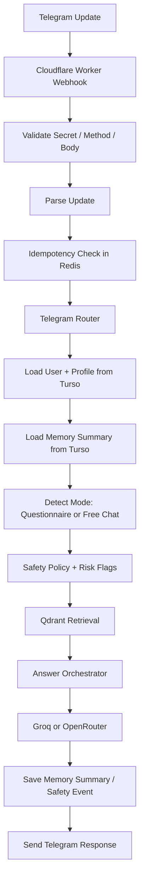

# CLOUD ARCHITECTURE — BELITA Skin Match

Сегодня: `2026-03-28`  
Роль: `Cloud Runtime / Architecture Handoff`  
Режим: `No full bot code, interfaces + structure + flow only`

## 0. Runtime Conflict Resolution

### Жесткий выбор

Выбран `Вариант А`:

- `TypeScript`
- `grammY`
- `Hono`
- `Cloudflare Workers Free`

Python остается только для локального ingestion / enrichment / indexing pipeline.

### Почему не Вариант Б

#### Почему не `Python + Vercel`

По checked official sources:

- `Vercel Hobby` ограничен `personal/non-commercial use`.
- Python runtime на Vercel помечен как `Beta`.
- Cron на Hobby ограничен `once per day` и без точного тайминга.

Вывод:
- Vercel подходит для personal webhook demo;
- это слабая основа для бесплатного, но реально работающего `24/7` bot runtime.

#### Почему не `Python + Render Free`

По checked official sources:

- Free web services on Render spin down after `15` minutes without traffic.
- Spin-up can take about `1 minute`.
- Free Postgres expires after `30` days.

Вывод:
- для always-available bot UX это слишком хрупко;
- cold starts и expiring DB делают free-tier ненадежным именно для нашей задачи.

#### Почему не `Python + Koyeb`

По checked official sources:

- pricing messaging у Koyeb сложнее и менее однозначна, чем у Cloudflare;
- starter/hobby/free path и pay-as-you-go semantics создают больше billing ambiguity;
- free compute path менее clear-cut, чем у Workers Free.

Вывод:
- Koyeb можно изучать позже;
- но как hard choice на reliable free `24/7` foundation он проигрывает Workers.

### Почему выбран `TypeScript + grammY + Hono + Cloudflare Workers`

По checked official sources:

- `Cloudflare Workers Free` дает `100,000` requests/day.
- Workers Free имеет predictable serverless webhook model.
- `grammY` имеет официальный guide по Cloudflare Workers.
- `Hono` официально заточен под Cloudflare Workers и Module Worker mode.

Итог:
- для бесплатного online runtime это самый надежный verified путь;
- конфликт Python vs Cloudflare решается через разделение:
  - `Python` = offline data pipeline
  - `TypeScript` = online bot runtime

## 1. Целевой Cloud Scope

### Что остается локальным

- scraping donor sites
- INCI enrichment
- SQLite normalization
- local validation
- local reindex preparation

### Что уходит в облако

- Telegram webhook runtime
- user profile storage
- conversation memory summaries
- transient session/cache
- online vector retrieval
- LLM orchestration and fallback

## 2. Target Stack

| Layer | Choice | Why |
|---|---|---|
| Runtime | `Cloudflare Workers Free` | strongest verified free webhook runtime |
| HTTP framework | `Hono` | native Cloudflare support, thin routing layer |
| Bot framework | `grammY` | webhook-friendly Telegram framework with Workers docs |
| SQL | `Turso Free` | online relational store for users/profile/memory |
| Vector DB | `Qdrant Cloud Free` | best verified free managed vector store |
| Cache / FSM | `Upstash Redis Free` | serverless ephemeral state and throttling |
| LLM primary | `Groq Free` | best verified free inference primary |
| LLM fallback | `OpenRouter free` | backup path when Groq quota/errors occur |

## 3. Deployment Pattern

### Architecture Pattern

- `modular monolith`
- `serverless runtime`
- `ports and adapters`
- `split data plane`

### Communication Pattern

- Telegram -> HTTPS webhook
- Worker -> Turso HTTP/libSQL
- Worker -> Qdrant HTTPS API
- Worker -> Upstash REST API
- Worker -> Groq/OpenRouter HTTPS APIs

### Data Pattern

- `CRUD` for user/profile/memory in Turso
- `vector retrieval` in Qdrant
- `cache / counters / short FSM state` in Upstash Redis
- `rules + retrieval + LLM synthesis`

## 4. Directory Structure

Предлагаемая структура для cloud runtime:

```text
cloud-bot/
  package.json
  tsconfig.json
  wrangler.jsonc
  src/
    index.ts
    env.ts
    boot/
      create-app.ts
      create-container.ts
    entrypoints/
      http/
        telegram-webhook.ts
        health.ts
        admin.ts
    router/
      telegram-router.ts
    application/
      commands/
        handle-update.ts
        run-questionnaire.ts
        run-free-chat.ts
      queries/
        get-user-profile.ts
        retrieve-products.ts
      dto/
        inbound.ts
        outbound.ts
      services/
        answer-orchestrator.ts
        retrieval-orchestrator.ts
        profile-orchestrator.ts
        degrade-orchestrator.ts
    domain/
      entities/
        user-profile.ts
        recommendation.ts
        memory-summary.ts
      value-objects/
        concern.ts
        skin-type.ts
        risk-flag.ts
      services/
        safety-policy.ts
        recommendation-policy.ts
        fallback-policy.ts
      rules/
        medical-guardrails.ts
        answer-bounds.ts
    ports/
      user-repository.ts
      vector-store.ts
      cache-store.ts
      llm-client.ts
      logger.ts
      clock.ts
    adapters/
      turso/
        turso-user-repository.ts
        turso-memory-repository.ts
        turso-mappers.ts
      qdrant/
        qdrant-vector-store.ts
        qdrant-mappers.ts
      upstash/
        upstash-cache-store.ts
      llm/
        groq-client.ts
        openrouter-client.ts
        llm-router.ts
      telegram/
        telegram-update-parser.ts
        telegram-response-sender.ts
    prompts/
      system-prompt.ts
      templates.ts
    observability/
      metrics.ts
      request-log.ts
      error-map.ts
    shared/
      errors.ts
      result.ts
      ids.ts
      json.ts
      timeouts.ts
      http.ts
  tests/
    unit/
    integration/
    contract/
```

## 5. Ports & Adapters Contracts

Ниже контракты приведены как архитектурные интерфейсы, не как full implementation.

## 5.1 `IUserRepository` — Turso

Назначение:
- persistent user state
- questionnaire profile
- memory summaries
- safety flags

Что нельзя:
- хранить raw Telegram update blobs как основную memory;
- хранить diagnosis-like medical records;
- смешивать ephemeral FSM state и persistent profile.

```ts
export interface IUserRepository {
  getUserByTelegramId(telegramId: string): Promise<UserRecord | null>
  createUserIfMissing(input: CreateUserInput): Promise<UserRecord>
  getProfile(userId: string): Promise<UserProfile | null>
  upsertProfile(userId: string, patch: UserProfilePatch): Promise<UserProfile>
  getMemorySummary(userId: string): Promise<MemorySummary | null>
  saveMemorySummary(userId: string, summary: MemorySummary): Promise<void>
  appendSafetyEvent(userId: string, event: SafetyEvent): Promise<void>
  getRuntimePreferences(userId: string): Promise<RuntimePreferences>
}
```

Serverless notes:
- использовать HTTP/libSQL-friendly access pattern;
- не строить большие long-lived pools;
- держать client singleton на уровне модуля;
- короткие timeouts и idempotent retries только для safe reads.

## 5.2 `IVectorStore` — Qdrant Cloud

Назначение:
- semantic retrieval по product knowledge
- filters by payload
- safe candidate recall for recommendation

Что нельзя:
- писать векторную базу из request path;
- делать reindex внутри webhook handler;
- считать Qdrant source of truth для user memory.

```ts
export interface IVectorStore {
  searchProducts(input: ProductSearchQuery): Promise<ProductSearchResult[]>
  searchByConcern(input: ConcernSearchQuery): Promise<ProductSearchResult[]>
  healthcheck(): Promise<VectorStoreHealth>
}
```

`ProductSearchQuery` должен поддерживать:
- `queryText`
- `topK`
- `filters.skinTypes`
- `filters.concerns`
- `filters.excludeFragrance`
- `filters.excludeAcids`
- `filters.requireGentle`

Serverless notes:
- использовать HTTPS API, не stateful gRPC channel;
- ограничить `topK`, чтобы не жечь free quotas;
- короткий timeout и fallback path при search failure.

## 5.3 `ICacheStore` — Upstash Redis

Назначение:
- FSM state
- anti-flood counters
- short-lived prompt/retrieval cache
- idempotency markers

Что нельзя:
- хранить permanent user profile;
- хранить единственную копию important state;
- хранить long-term memory без backup in SQL.

```ts
export interface ICacheStore {
  getJson<T>(key: string): Promise<T | null>
  setJson<T>(key: string, value: T, ttlSeconds: number): Promise<void>
  increment(key: string, ttlSeconds: number): Promise<number>
  delete(key: string): Promise<void>
  acquireIdempotencyKey(key: string, ttlSeconds: number): Promise<boolean>
}
```

Serverless notes:
- только REST-friendly calls;
- TTL обязателен почти для всего;
- shared key naming convention:
  - `fsm:{telegramId}`
  - `rl:{telegramId}:{bucket}`
  - `cache:retrieval:{hash}`
  - `idem:{updateId}`

## 5.4 `ILLMClient` — Groq / OpenRouter

Назначение:
- final answer synthesis
- bounded explanation using retrieved context
- fallback between providers

Что нельзя:
- отправлять в LLM запрос без system prompt;
- генерировать ответ без safety policy;
- надеяться на один provider.

```ts
export interface ILLMClient {
  generateAnswer(input: LLMAnswerInput): Promise<LLMAnswerOutput>
  summarizeMemory(input: MemorySummaryInput): Promise<MemorySummaryOutput>
  healthcheck(): Promise<LLMHealth>
}
```

`LLMAnswerInput` должен содержать:
- `systemPrompt`
- `userMessage`
- `retrievedProducts`
- `userProfile`
- `memorySummary`
- `riskFlags`
- `mode` (`questionnaire` | `free_chat`)

## 6. Webhook Entrypoint Flow

## 6.1 High-level flow



## 6.2 Detailed step sequence

1. Telegram sends update to Worker URL.
2. Webhook handler validates:
   - `POST` method
   - secret path or secret header
   - JSON body
3. Handler parses minimal update metadata.
4. Redis checks idempotency using `update_id`.
5. Router determines scenario:
   - `/start`
   - questionnaire answer
   - free chat message
   - callback action
6. Application layer loads user/profile/memory from Turso.
7. Safety policy detects risk:
   - medical-like concern
   - unsupported topic
   - high uncertainty
8. Retrieval orchestrator queries Qdrant with filters built from:
   - user profile
   - concern
   - fragrance/acids/gentle constraints
9. Answer orchestrator builds bounded context.
10. `ILLMClient` chooses Groq, then OpenRouter on fallback.
11. Response formatter returns Telegram-safe message.
12. Memory summary is updated in Turso.

## 7. Query Shaping and Retrieval Strategy

### Input shaping

Из сообщения пользователя извлекаются:
- `intent`
- `skin_type hints`
- `concerns`
- `avoid flags`
- `risk flags`

Пример:
- user: `у меня экзема, нужен мягкий крем без отдушек`
- query object:
  - `concerns = ["sensitive", "barrier", "dryness"]`
  - `excludeFragrance = true`
  - `requireGentle = true`
  - `riskFlags = ["self_reported_condition"]`

### Retrieval policy

1. сначала hard filters
2. потом semantic search
3. потом small rerank in application layer
4. потом only bounded answer synthesis

## 8. Graceful Degradation

## 8.1 If `Turso` times out

Код должен:

1. не падать whole request;
2. попробовать read fallback один раз с коротким retry;
3. если не получилось:
   - перейти в `stateless mode`;
   - не использовать personalized memory;
   - ответить как новому пользователю с ограниченной персонализацией;
   - не делать risky claims based on missing context.

Behavior:
- questionnaire flow:
  - просим коротко уточнить ключевой параметр, если он критичен;
- free chat:
  - отвечаем safe general guidance внутри бренда Belita/Vitex.

Нельзя:
- silently invent user profile;
- вытаскивать старое состояние только из Redis как permanent truth.

## 8.2 If `Qdrant Cloud` is unavailable

Код должен:

1. не делать вид, что retrieval был успешен;
2. перейти в `knowledge-limited mode`;
3. использовать только:
   - generic safe guardrails,
   - previously cached lightweight suggestions,
   - curated fallback shortlist if it exists.

Behavior:
- если нет retrieval context:
  - не рекомендовать точечные продукты с высокой уверенностью;
  - дать мягкий bounded ответ:
    - объяснить ограничение
    - предложить базовый safe-care direction
    - попросить повторить позже для точного подбора

Нельзя:
- hallucinate product-specific explanation без retrieval context.

## 8.3 If `Upstash Redis` is unavailable

Код должен:

- продолжать работать без cache/FSM continuity;
- отключить non-critical caching;
- сохранить only essential request flow.

Риск:
- хуже UX в многосообщенческом диалоге;
- но бот не должен становиться completely unavailable.

## 8.4 If `Groq` fails or quota exceeded

Код должен:

1. переключиться на `OpenRouter free`;
2. если и fallback недоступен:
   - отдать safe minimal response;
   - не зависнуть.

## 9. Connection and Resource Policy in Serverless

### Turso

- module-scoped client singleton
- short timeout
- read retries only for idempotent reads
- writes only once or via safe retry with idempotency

### Upstash Redis

- REST-based, no socket pooling
- aggressive TTL usage
- avoid chatty multi-round trips

### Qdrant Cloud

- bounded `topK`
- narrow payload filters
- short timeout
- no indexing from request handler

### LLM providers

- hard token budget
- small prompt assembly
- cache repeated safe answers where possible

## 10. Files and Responsibility Boundaries

### What belongs to cloud runtime repo/module

- webhook handling
- adapters to cloud stores
- routing
- orchestration
- response formatting
- observability

### What must stay outside runtime request path

- donor scraping
- INCI enrichment
- bulk normalization
- full reindex pipeline
- heavy ETL

## 11. Acceptance Criteria

- Runtime choice resolved in favor of `TypeScript + Cloudflare Workers`.
- Python remains only in offline ingestion lane.
- Interfaces are defined for:
  - `IUserRepository`
  - `IVectorStore`
  - `ICacheStore`
  - `ILLMClient`
- Webhook request path is fully described.
- Graceful degradation is defined for:
  - Turso timeout
  - Qdrant unavailability
- Cloud design respects free-tier serverless constraints.

## 12. Final Verdict

Для бесплатного `24/7` cloud path у этого проекта правильное решение:

- оставить Python для data-prep;
- вынести online bot runtime в `TypeScript`;
- строить cloud module на `grammY + Hono + Cloudflare Workers`;
- использовать `Turso + Qdrant Cloud + Upstash Redis`;
- проектировать весь runtime через ports/adapters, чтобы later migration to paid floor не ломала доменную логику.
